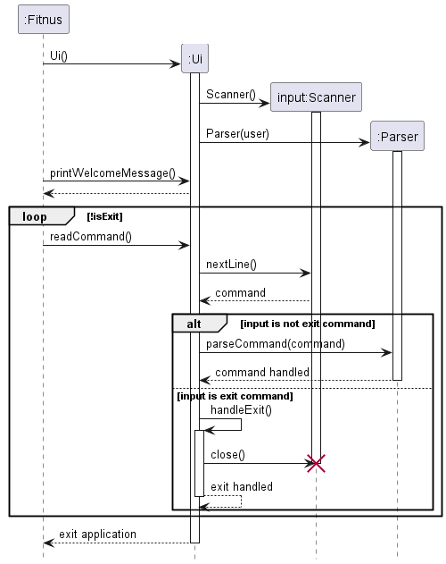
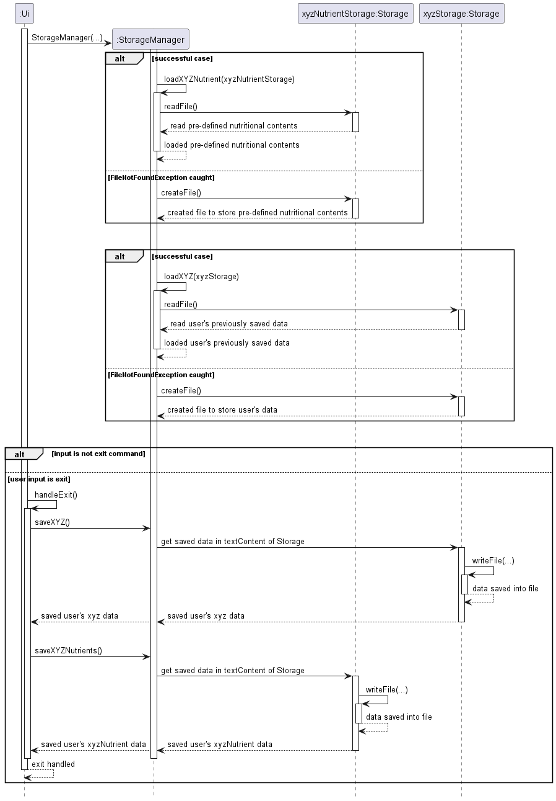
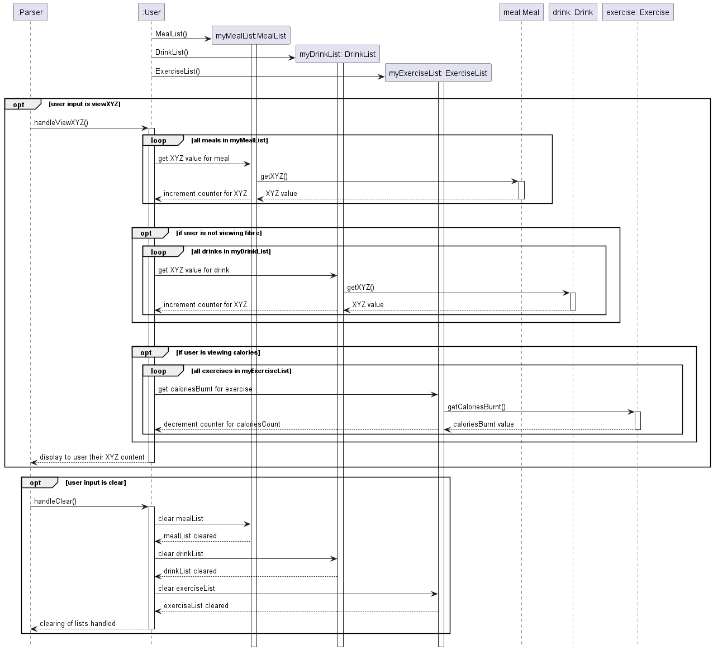
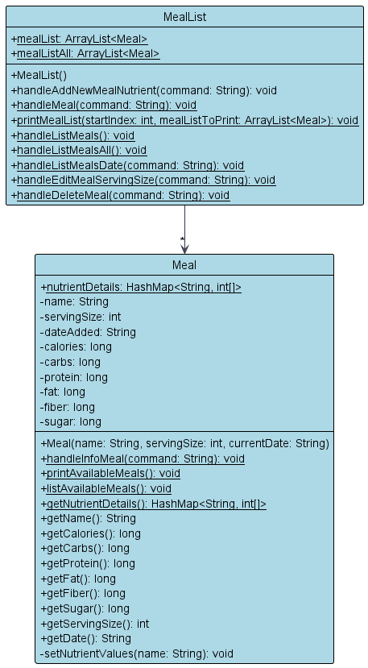
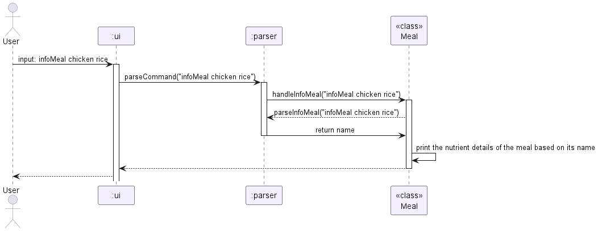
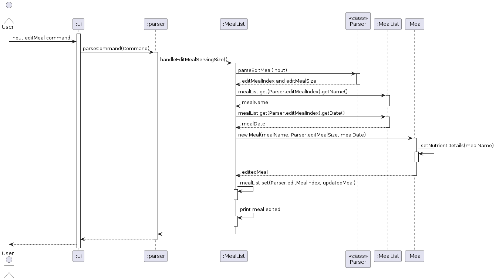

<link rel="stylesheet" href="https://cdnjs.cloudflare.com/ajax/libs/font-awesome/5.15.4/css/all.min.css">

# Developer Guide

---

## Table of Contents
<!-- TOC -->
* [Acknowledgements](#acknowledgements)
* [Design](#design)
  * [Architecture](#architecture)
  * [Ui Component](#ui-component)
  * [Storage Component](#storage-component)
  * [User Component](#user-component)
  * [Exercise Component](#exercise-component)
  * [Drink Component](#drink-component)
  * [Meal Component](#meal-component)
* [Implementation](#implementation)
  * [Information on a Particular Meal Command](#information-on-a-particular-meal-command)
  * [Eat Command](#eat-command)
  * [Edit Meal Command](#edit-meal-command)
  * [New Meal Command](#new-meal-command)
* [Product Scope](#product-scope)
* [User Stories](#user-stories)
* [Non-Functional Requirements](#non-functional-requirements)
* [Instructions for Manual Testing](#instructions-for-manual-testing)
<!-- TOC -->

---

## Acknowledgements

Below are the references used on the project:
1. [Developer Guide](https://se-education.org/addressbook-level3/DeveloperGuide.html)
2. [User Guide](https://se-education.org/addressbook-level3/UserGuide.html)

---
## Design

### Architecture

The architecture diagram belows shows the overall design of our FitNUS CLI app and how each component interact with each other.

**Main Components of The Architecture**

- `FitNUS`: FitNUS main code which runs the program until termination
- `Ui`: The user interface of the app that reads in user input
- `Storage`: Handles storage of all `meal`, `drink` and `exercise` that the user has input
- `Parser`: Parses user input
- `User`: Handles user input and stores the `Exercise`, `Drink`, `Meal`, and `Water` created by user
- `Date`: Handles user's local machine date
- `ExerciseList`: Exercises completed and its duration created by user
- `DrinkList`: Drinks intake (including water) and its nutritional values created by user
- `MealList`: Meals intake and its nutritional values created by user

### Ui Component
#### Sequence Diagram
_Note: The following sequence diagram captures the interactions only between the Fitnus, Ui and Parser classes_

         

When the user first starts the application, the Ui class will be constructed. Within the Ui class, Scanner and Parser 
similarly will be constructed.

The Ui class will continuously read the user input:
- If the user input DOES NOT correspond to "exit", Ui will pass the user input to Parser class. Parser class will both 
  parse and handle the command.
- Else if the user input corresponds to "exit", Ui will handle the exit.

### Storage Component
#### Description
The Ui component will create a `StorageManager` to manage the reading and writing of the `Storage` (meal, drink, and exercise).
There are two types of data being stored, one to keep track of what the user has inputted to the app, and one to keep track
of the nutritional information of the known meal/drinks/exercise.

#### Implementation
- File Location:
  - The user's meal, drinks, and exercise data is stored into text files in 
  `./data/MealList.txt`, `./data/DrinkList.txt`, and `./data/ExerciseList.txt`, respectively. 
  - The nutritional information of all available meals, drinks, and exercises is stored into csv files in
  `./db/Meal_db.csv`, `./db/Drink_db.csv`, `./db/Exercise_db.csv`, respectively.
- Format:
  - All `Meal` objects in `MealList` will be formatted and stored in a string format of "`MEAL_NAME`,`SERVING_SIZE`,`DATE`"
  - All `Drink` objects in `DrinkList` will be formatted and stored in a string format of "`DRINK_NAME`,`SERVING_VOLUME`,`DATE`"
  - All `Exercise` objects in `ExerciseList` will be formatted and stored in a string format of "`EXERCISE_NAME`,`DURATION`,`INTENSITY`,`DATE`"
  - All meal nutrients are stored in the format of "`MEAL_NAME`,`CALORIES`,`CARBS`,`PROTEIN`,`FAT`,`FIBER`,`SUGAR`"
  - All drink nutrients are stored in the format of "`DRINK_NAME`,`CALORIES`,`CARBS`,`SUGAR`,`PROTEIN`,`FAT`"
  - All exercise information is stored in the format of "`EXERCISE_NAME`,`HIGH_INTENSITY`,`MEDIUM_INTENSITY`,`LOW_INTENSITY`"
- Loading: When the app starts, the `StorageManager` will load and parse all the nutrient information from the csv files and put it into 
a HashMap in the `Meal`, `Drink`, and `Exercise` class. However, if the csv files are not found, it will create a new csv file
and store some pre-defined contents. Then, `StorageManager` will load and parse all the user data from the txt files and append it
into list in the `MealList`, `DrinkList`, and `ExerciseList`. If the txt files are not found, it will create a new txt file.
- Writing: When the user enter the `exit` command, the `StorageManager` will retrieve all the `Meal`, `Drink`, and `Exercise` objects
from the list and format it into string. Then, it will append all the strings and write the files to the corresponding `Storage`.

#### Class Diagram

#### Sequence Diagram
_Note: The following sequence diagram captures the interactions only between the Ui, Storage and StorageManager 
classes when loading and saving data.  
XYZ is used as a placeholder for Meal / Drink / Exercise for diagram simplicity._ 

### User Component
#### Description
The User component will create MealList, DrinkList and ExerciseList for the user to track their data. Additionally, 
this component is in-charge of handling view, listEverything, recommend and clear commands.

#### Implementation
User Class:
- Attributes:
  - `myMealList:` Represents the user's class that managers the meal lists.
  - `myDrinkList:` Represents the user's class that managers the drink lists.
  - `myExerciseList:` Represents the user's class that managers the exercise lists.

- Methods:
  - `handleViewCalories()`: Prints the user's net calorie intake of the day.
  - `handleViewCarbohydrates()`: Prints the user's total carbohydrates intake of the day.
  - `handleViewProteins()`: Prints the user's total protein intake of the day.
  - `handleViewFiber()`: Prints the user's total fiber intake of the day.
  - `handleViewFat()`: Prints the user's total fat intake of the day.
  - `handleViewSugar()`: Prints the user's total sugar intake of the day.
  - `handleListEverything()`: Prints all meals and drinks that the user has inputted today.
  - `handleListEverythingAll()`: Prints all meals and drinks that the user has inputted of all-time.
  - `handleListEverythingDate()`: Prints all meals and drinks that the user has inputted on a specified date.
  - `handleClear()`: Clears all user's entries of the day.
  - `handleRecommendations()`: Give recommendations to the user based on their calorie and water intake.

#### Sequence Diagram
_Note: The following sequence diagram captures the interactions only between the User, MealList, DrinkList and 
ExerciseList classes._   

For diagram simplicity, the following choices were made when creating the diagram:
- Only optional blocks for handleViewXYZ() and handleClear() methods were created.   
  As such, methods within User such as 
  handleRecommendations() and handleListEverything()  were omitted.
- For methods where the user would like to view their nutrional content (handleViewXYZ), XYZ is used as a placeholder 
  for the specified nutritional content (e.g. calories, carbohydrates, protein etc.)

User class initialises MealList, DrinkList and ExerciseList for the user to track their data.

### Exercise Component

1. Upon starting up the application, User will call `loadExercise` to fetch all data from `ExerciseList.txt` and add it into `exerciseListAll`.
2. A `User` class consists of zero to as many `Exercise` objects in the ArrayList.
3. Each `Exercise` contains exactly one enumeration of `ExerciseIntensity`.
### Drink Component

1. Upon starting up the application, User will call `loadDrink` to fetch all data from `DrinkList.txt` and add it into `drinkListAll`.
2. A `User` class consists of zero to as many `Drink` objects in the ArrayList and zero to as many `Water` objects in the ArrayList.
### Meal Component

1. Upon starting up the application, User will call `loadMeal` to fetch all data from `Mealist.txt` and add it into `mealListAll`.
2. A `User` class consists of zero to as many `Meal` objects in the ArrayList.

---
## Implementation

### Information on a Particular Meal Command
The `infoMeal` command allows user to obtain the nutritional values (protein, calories, carbs, etc.) of a particular 
meal. The following sequence diagram shows the execution of the `infoMeal` command

1. The user inputs an `infoMeal` command of the format `infoMeal m/MEAL` in this example we use `infoMeal m/ chicken rice` which is inputted to the `ui` object
2. The `ui` object calls the `parseCommand()` method of the `parser` object
3. The parser parses the command and calls the appropriate method, which in this case is `handleInfoMeal()` of `Meal` class
4. The `Meal` class then calls the `parseInfoMeal` method to retrieve the meal name from the command
5. After obtaining the name of the meal from `parser` object, the `Meal` class will print out the nutrient details of that particular meal.

### Eat Command
The `eat` command is responsible for handling the tracking of meal and adding it to the Meal List. 
The following sequence diagram shows the execution of the `eat` command.

1. The user inputs an `eat` command of the format `eat m/MEAL s/SERVING_SIZE` into the `ui` object
2. The `ui` object calls the `parseCommand()` method of the `parser` object
3. The parser parses the command and calls the appropriate method, which in this case is `handleMeal()` method of `MealList`
4. The `MealList` object then calls the `parseMeal` method to retrieve the information from the command such as the meal name and serving size
5. With the meal details retrieved from the parser, a new `Meal` object with the given parameters (meal name, serving size) is created and returned to `MealList`
6. When creating a new `Meal` object, it will call its own method `setNutrientDetails()` to set the nutrients for that specific meal using the meal name
7. The newly created `Meal` object is then added to the `MealList`
8. Upon successful tracking of a meal a confirmation message is printed

Note: The implementation for `drink` and `exercise` command have similar sequence diagrams

### Edit Meal Command
The `editMeal` command allows users to edit the serving sizes of their meals that have already been added to the Meal List.
The following sequence diagram shows the execution of the `editMeal` command.

1. The user inputs an `editMeal` command of the format `editMeal INDEX s/NEW_SERVING_SIZE` into the `ui` object
2. The `ui` object calls the `parseCommand()` method of the `parser` object
3. The parser parses the command and calls the appropriate method, which in this case is `handleEditMealServingSize()` method of `MealList`
4. The `MealList` object then calls the `parseEditMeal` method to retrieve the information from the command such as the intended meal index and current serving size
5. With the meal name and current serving size retrieved, the `Meallist` objects retrieves the name and nutrient details of the meal by calling the `getName()` and `getData()` methods of the `Meal` object
6. A new `Meal` object with the updated serving size is created and returned to `MealList`
7. The newly created `Meal` object is then replaces the meal at the specified position in this list by calling the `set()` method of `MealList`
8. Upon successful tracking of a meal a confirmation message is printed

Note: The implementation for `editDrink` and `editWater` command have similar sequence diagrams

### New Meal Command
The `newMeal` command allows users to add new meal to the list of available meals by specifying the meal name and its nutrients.
The following sequence diagram shows the execution of the `newMeal` command.

1. The user inputs an `newMeal` command of the format `newMeal MEAL_NAME,CALORIES,CARBS,PROTEIN,FAT,FIBER,SUGAR` into the `ui` object
2. The `ui` object calls the `parseCommand()` method of the `parser` object
3. The parser parses the command and calls the appropriate method, which in this case is `handleAddNewMealNutrient()` method of `MealList`
4. The `MealList` object then calls the `parseNewMeal` method to retrieve the information from the command such as the mean name, calories, carbs, protein, fat, fiber and sugar
5. The Nutrient of the details are then stored in the `nutrientDetails` hashmap attribute of the `Meals` class using the `put()` method of the hashmap
6. Upon successful tracking of a meal a confirmation message is printed

Note: The implementation for `newDrink` and `newExercise` command have similar sequence diagrams

### Delete Meal Command
The `deleteMeal` command allows users to delete a meal from the list of meals they have consumed today by specifying the meals index in accordance with the `listMeals` command.
1. The user inputs an `deleteMeal` command of the format `deleteMeal INDEX` into the `ui` object
2. The `ui` object calls the `parseCommand()` method of the `parser` object
3. The parser parses the command and calls the appropriate method, which in this case is `handleDeleteMeal()` method of `MealList`
4. The `MealList` object then calls the `parseDeleteMeal` method to retrieve the information from the command, which is the index of the meal to be deleted.
5. The meal is then removed by calling the `remove()` method of `MealList` and passing the index of the specified meal as a parameter
6. Upon successful deletion of a meal a confirmation message is printed

---
## Product scope
### Target user profile
- Have a need to manage their dietary intake and exercise routines effectively.
- Prefer desktop applications over other types of platforms.
- Can type quickly and prefer typing over mouse interactions.
- Are reasonably comfortable using command-line interface (CLI) applications.

### Value proposition

The fitness app aims to help users manage their dietary habits and exercise routines more efficiently compared to traditional GUI-driven apps. 
By offering a streamlined interface optimized for keyboard input and CLI interactions, users can track their meals, drinks, and exercises swiftly, allowing them to focus more on their fitness and nutritional goals and less on navigating through complex user interfaces.

---
## User Stories

| Version | As a ... | I want to ...                                                                                                                         | So that I can ...                                                                                                     |
|---------|------|---------------------------------------------------------------------------------------------------------------------------------------|-----------------------------------------------------------------------------------------------------------------------|
| v1.0    | new user | view all the commands on how to use the app                                                                                           | navigate through the app easily and be able to use all the features                                                   |
| v1.0    | user | add my daily meals and the serving for each meal                                                                                      | keep track of what I have eaten in a day                                                                              |
| v1.0    | user | add my daily drinks and the volume for each drink                                                                                     | keep track of what I have drunk in a day                                                                              |
| v1.0    | user | add and view my daily water intake                                                                                                    | keep track of my water intake for the day                                                                             |
| v1.0    | user | list the meals I ate today                                                                                                            | view all the foods I have eaten in a day                                                                              |
| v1.0    | user | list the drinks I drank today                                                                                                         | view all the drinks I have drunk in a day                                                                             |
| v1.0    | user | view the nutritional information about every food and drink                                                                           | choose to stay away or consume that particular food or drink                                                          |
| v1.0    | user | view all my macronutrients (protein, carbs, fat) intake for today                                                                     | make sure that I am getting enough macronutrient and not exceeding the recommended level per day                      |
| v1.0    | diabetic user | view the sugar intake from my foods and drinks consumed for today                                                                     | keep track and not exacerbate my diabetes condition and damage my nerves                                              |
| v1.0    | user | view my calorie intake for today                                                                                                      | increase or decrease my food/drink intake accordingly                                                                 |
| v2.0    | user | add and view the exercises I have done for today                                                                                      | keep my self active and exercise frequently                                                                           |
| v2.0    | user | view the calories I burned through exercising for today                                                                               | keep track of my total calorie intake and expenditure for today                                                       |
| v2.0    | user | view the recommended water and calories intake for today                                                                              | easily add or decreasy my needs without having to count manually                                                      |
| v2.0    | user | delete a particular drink/meal/exercise I have done for today                                                                         | delete the stuffs that I actually did not do or consume for today                                                     |
| v2.0    | user | edit the serving size of a particular meal I have eaten for today                                                                     | correct mistakes I made when I added a food                                                                           |
| v2.0    | user | edit the volume intake of a particular drink I have drunk for today                                                                   | correct mistakes I made when I added a drink                                                                          |
| v2.0    | user | edit the water intake for today                                                                                                       | correct mistakes I made when I added water                                                                            |
| v2.0    | user | add a new drink to the available drinks                                                                                               | add drinks that the app did not recognize                                                                             |
| v2.0    | user | add a new meal to the available drinks                                                                                                | add meals that the app did not recognize                                                                              |
| v2.0    | user | add a new exercise to the available drinks                                                                                            | add exercises that the app did not recognize                                                                          |
| v2.0    | user | store and load all the meals and drinks I have consumed and also the exercises I have done throughout the entire lifecycle of the app | view all of the existing data even after I close the app                                                              |
| v2.0    | user | view all the meals and drinks I have consumed and also the exercises I have done throughtout the entire lifecycle of the app          | keep a record of my exercises, macronutrients and calories I have done and consumed for a week, a month, or even more |

## Non-Functional Requirements

1. Should work on any mainstream OS (Linux, Windows, MacOS) as long as it has Java 11 or above installed.
2. A user with above average typing speed for regular English text (i.e. not code, not system admin commands) should be able to accomplish most of the tasks faster using commands than using the mouse.

---
## Glossary

* *meal* - Any food consumed.
* *drink* - Any beverage consumed.
* *exercise* - Any physical activity performed.
* *calories* - Measure of energy derived from food.
* *carbohydrates* - Macronutrient providing energy.
* *proteins* - Macronutrient essential for growth and repair.
* *fat* - Macronutrient important for energy storage and insulation.
* *sugar* - Simple carbohydrate often added to food for sweetness.
* *fiber* - Indigestible plant material aiding digestion.
* *water* - Essential liquid for hydration and bodily functions.

---
## Instructions for Manual Testing
Given below are instructions to test the app on your own device.
### Launch and Shutdown
1. Initial Launch
   1. Create an empty folder, download the jar file, and place the file inside the folder.
   2. Open the terminal and navigate to the folder you just created.
   3. Type `java -jar [name of the jar]`, e.g.`(java -jar FitNUS.jar)` on the CLI.
2. Window Preference
   1. Resize the window to an optimum size. Ideally full screen, as some text might not be displayed correctly.
3. App Features and Commands
4. Save and Shutdown
   1. Type `exit` to shut down the FitNUS app.
   2. Upon exiting, all entries inputted will be updated to the database locally.

### Basic Features
Given below are the basic features of our FitNUS, do note that it's not the complete list of commands.
Please refer to our User Guide for the full list of our features.

#### <i class="fas fa-star"></i> Add a meal eaten: `eat`
Adds a meal to the list of meals consumed today.

**Format**: `eat m/MEAL s/SERVING_SIZE`  
**Sample Input**: `eat m/Chicken Rice s/1`  
**Expected Output**:
~~~
Added 1 serving of chicken rice
~~~

#### <i class="fas fa-star"></i> Find the information about a certain meal: `infoMeal`
For the specified meal, display its nutritional content **per serving** to the user.

**Format**: `infoMeal MEAL`  
**Sample Input**: `infoMeal chicken rice`  
**Expected Output**:
~~~
Meal: chicken rice (per serving)
Calories: 400 kcal
Carbs: 50 g
Protein: 30 g
Fat: 20 g
Fiber: 10 g
Sugar: 5 g
~~~

#### <i class="fas fa-star"></i> View daily net calorie count: `calories`
Display current net calorie count **in kcal**  for the day. This takes into account the calories consumed from meals
and drinks,
and the calories burnt from exercise.

**Format**: `calories`    
**Expected output**:
~~~
Total Calories: 230 kcal
~~~

#### <i class="fas fa-star"></i> List today's meal intake: `listMeals`
Display all the meals the user has inputted today.

**Format**: `listMeals`   
**Expected output**:
~~~
here's what you have eaten today
1. chicken rice (serving size: 1) | date: 01-04-2024
~~~

#### <i class="fas fa-star"></i> Delete a certain meal entry: `deleteMeal`
Delete a meal that was inputted today. You may identify the meal by its index in listMeals.

**Format**: `deleteMeal INDEX`  
**Sample Input**: `deleteMeal 1`  
**Expected output**:
~~~
Removed chicken rice from meals
~~~

#### <i class="fas fa-star"></i> Edit an existing meal after inserted: `editMeal`
For a meal that was inputted in the day, edit its serving size. You may identify the meal by its index in listMeals.

**Format**: `editMeal INDEX s/NEW_SERVING_SIZE`  
**Sample input**: `editMeal 2 s/10`  
**Expected output**:
~~~
chicken rice has been edited to 10 serving(s)
~~~